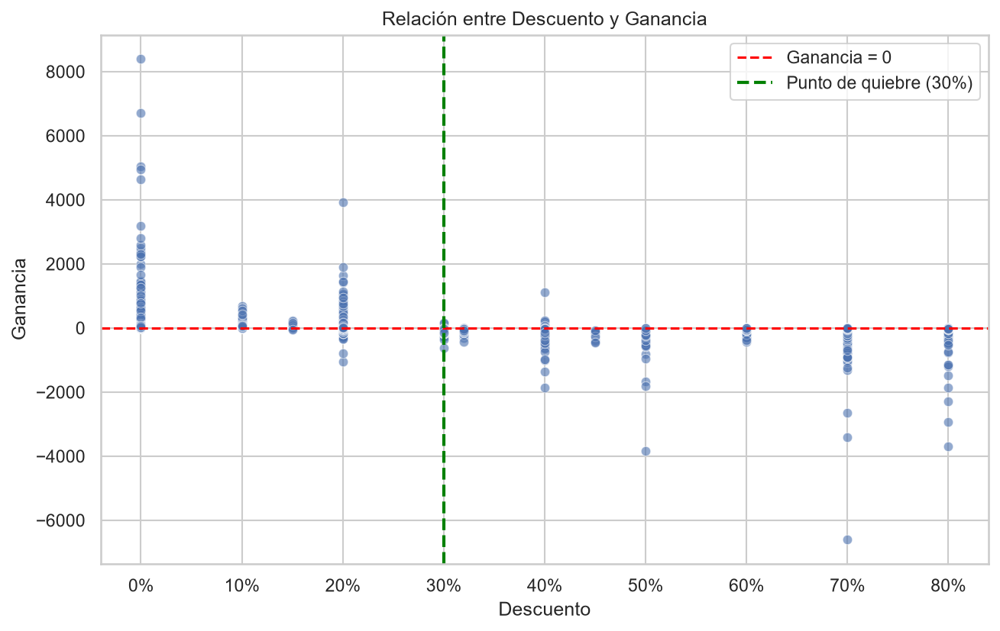
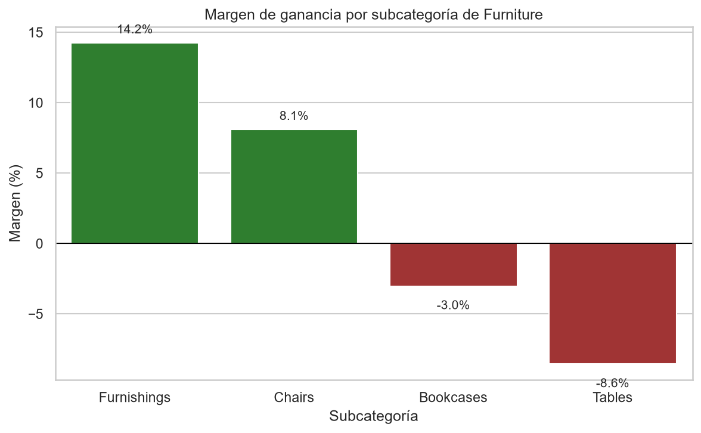
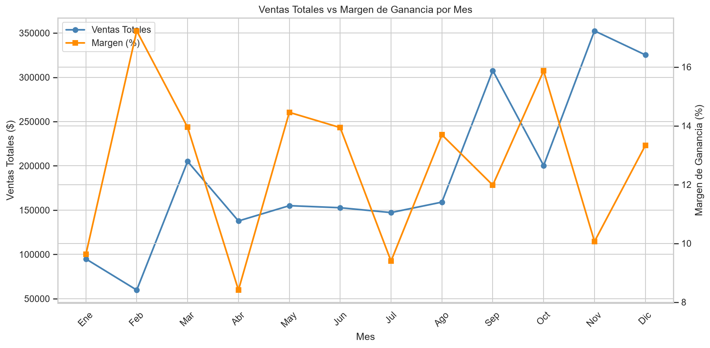
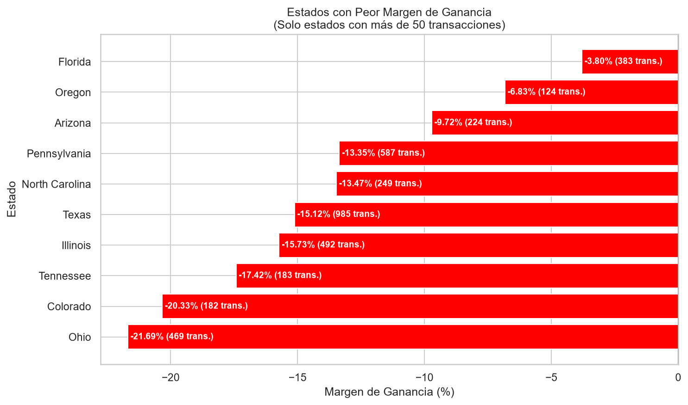

# 🛒 Análisis de Rentabilidad: Superstore Sales


🔗 **[Ver dashboard en vivo](https://superstore-sales-analysis-hgdlcqkjsdynupcjdjtv3m.streamlit.app)** | 📓 [Ver notebooks de análisis](notebooks/)

🔗 **[Ver dashboard en vivo](https://superstore-sales-analysis-hgdlcqkjsdynupcjdjtv3m.streamlit.app)** | 📓 [Ver notebooks de análisis](notebooks/)

Proyecto de ciencia de datos que analiza casi 10,000 transacciones de venta de una tienda minorista para identificar los factores que afectan su rentabilidad, aplicando análisis exploratorio de datos (EDA), pensamiento crítico y verificación estadística rigurosa.


## 📋 Contexto del proyecto

El dataset ([Superstore Sales Dataset - Kaggle](https://www.kaggle.com/datasets/vivek468/superstore-dataset-final)) contiene datos reales de ventas de una tienda minorista, sin errores intencionales de captura (a diferencia de un dataset "sucio"). El reto aquí no fue limpiar datos rotos, sino **investigar patrones de negocio ocultos** dentro de datos técnicamente correctos — encontrar por qué casi 1 de cada 5 transacciones genera pérdida, a pesar de que el negocio en su conjunto es rentable.

## 🎯 Objetivos

- Identificar los factores que más influyen en la rentabilidad del negocio
- Investigar causas raíz con evidencia estadística, no solo intuición
- Aplicar verificación rigurosa (tamaño de muestra, correlaciones) antes de reportar hallazgos
- Comunicar resultados con recomendaciones de negocio accionables

## 🛠️ Herramientas utilizadas

- **Python 3** — lenguaje principal
- **Pandas** — manipulación y análisis de datos
- **Matplotlib / Seaborn** — visualización de datos
- **Jupyter Notebook** — entorno de análisis
- **Git / GitHub** — control de versiones

## 📁 Estructura del repositorio

```
superstore-sales-analysis/
├── data/
│   └── Sample_Superstore.csv          # Dataset original
├── notebooks/
│   ├── 01_primer_vistazo.ipynb            # Diagnostico y exploracion inicial
│   ├── 02_limpieza_datos.ipynb            # Limpieza de fechas e investigacion profunda
│   ├── 03_analisis_exploratorio.ipynb     # Graficas finales curadas
│   └── 04_insights_finales.ipynb          # Resumen ejecutivo y recomendaciones
├── images/                             # Graficas exportadas para este README
├── requirements.txt                    # Librerias necesarias
└── README.md
```

## 🔍 Metodología de investigación

A diferencia de un proyecto de limpieza de datos, este análisis se centró en **investigación de causa raíz**:

1. **Diagnóstico inicial**: se identificó que el 18.7% de las transacciones generan pérdida, a pesar de que el negocio es rentable en su conjunto.
2. **Investigación de hipótesis**: se probó la relación entre descuento y ganancia (correlación -0.219), refinando la hipótesis hasta encontrar un punto de quiebre claro en 30% de descuento.
3. **Verificación estadística**: antes de reportar cualquier hallazgo regional o por estado, se verificó el tamaño de muestra para evitar conclusiones basadas en pocos datos (por ejemplo, se descartaron como no confiables los estados con menos de 50 transacciones).
4. **Autocorrección documentada**: durante el proceso se detectó y corrigió un error metodológico propio (una variable mal referenciada que hizo parecer que una región tenía margen negativo cuando en realidad era positivo) — documentado en el notebook 01 como parte del proceso de aprendizaje.

📓 Ver el proceso completo de investigación en [`02_limpieza_datos.ipynb`](notebooks/02_limpieza_datos.ipynb)

## 📊 Hallazgos principales

### Los descuentos superiores al 30% son el punto de quiebre de la rentabilidad

La correlación entre descuento y ganancia es de -0.219. Al analizar la ganancia promedio por umbral de descuento, se identifica un salto dramático entre 20% y 30% de descuento, donde la pérdida promedio se vuelve 11 veces más severa.



### La subcategoría Tables concentra el problema de rentabilidad en Furniture

Furniture tiene el margen más bajo del negocio (2.49%), pero el problema no está repartido parejo: Tables (-8.56%) y Bookcases (-3.02%) generan pérdida, mientras Furnishings (+14.24%) y Chairs (+8.10%) son rentables.



### Noviembre tiene el mayor volumen de ventas pero uno de los márgenes más bajos

El pico de ventas de noviembre-diciembre (consistente con Black Friday y temporada navideña) viene acompañado de un margen de solo 10.06%, comparado con 17.23% en febrero, el mes de menor volumen.



### Ohio, Illinois y Texas presentan problemas de rentabilidad confirmados

A diferencia de estados con pocas transacciones (donde un margen extremo podría ser casualidad estadística), estos tres estados combinan margen negativo con volumen alto (182 a 985 transacciones), confirmando que el problema es real y sistemático.



📓 Ver el resumen ejecutivo completo con recomendaciones en [`04_insights_finales.ipynb`](notebooks/04_insights_finales.ipynb)

## 📊 Dashboard interactivo

🔗 **[Abrir dashboard en vivo](https://superstore-sales-analysis-hgdlcqkjsdynupcjdjtv3m.streamlit.app)**

El proyecto incluye un dashboard construido con Streamlit para explorar las ventas de forma interactiva, con filtros por región, categoría y segmento de cliente.

También puedes ejecutarlo localmente:

```bash
streamlit run dashboard.py
```

## ✅ Tests

El módulo de procesamiento cuenta con tests unitarios que verifican el comportamiento de cada función de forma aislada.

```bash
python -m pytest tests/ -v
```

## ⚠️ Limitaciones

Este análisis identifica relaciones entre variables, pero no incorpora costos operativos, información de inventario ni datos logísticos, por lo que no demuestra causalidad absoluta. Algunos estados fueron excluidos de las conclusiones por tener muestras demasiado pequeñas para ser representativas. Se recomienda complementar este análisis con información de costos de adquisición y campañas comerciales para validar las causas identificadas.

## 🚀 Cómo reproducir este proyecto

```bash
# Clona el repositorio
git clone https://github.com/Ma-Daniela3224/superstore-sales-analysis.git
cd superstore-sales-analysis

# Crea y activa un entorno virtual
python -m venv venv
source venv/bin/activate  # En Windows: venv\Scripts\activate

# Instala las dependencias
pip install -r requirements.txt

# Abre los notebooks en orden
jupyter notebook
```

⭐ Si este proyecto te resultó útil o interesante, considera darle una estrella al repositorio.